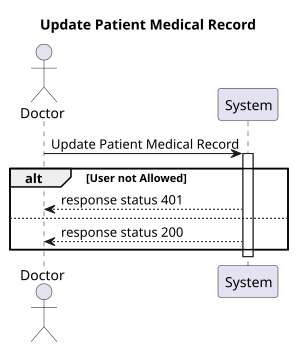
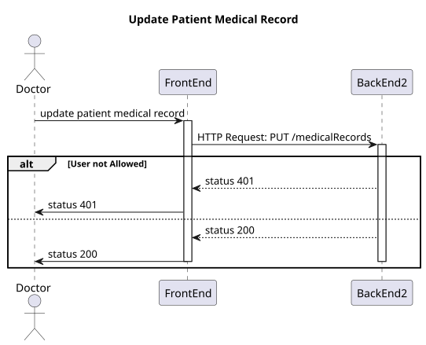
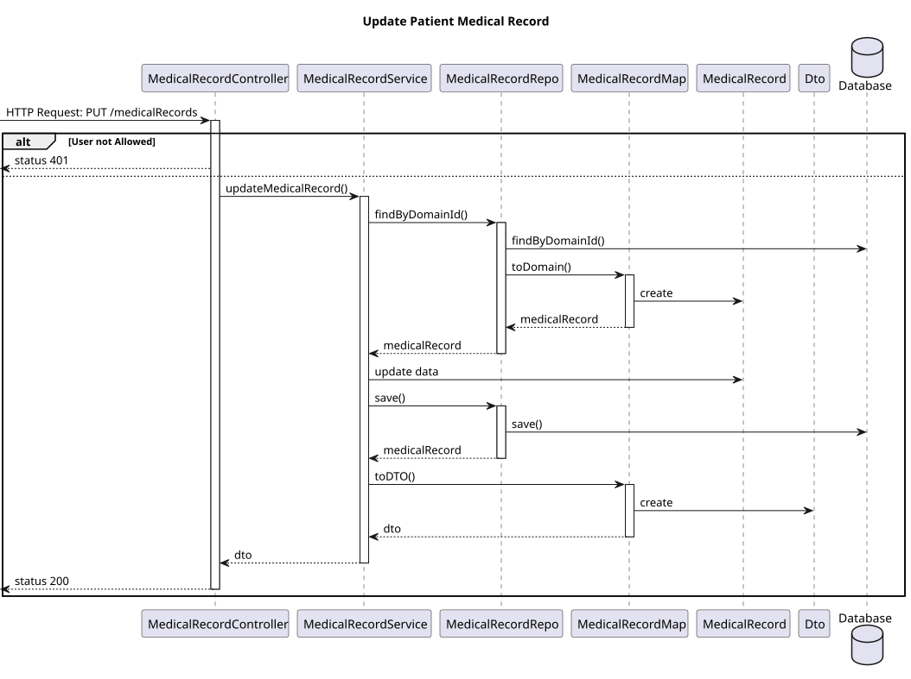
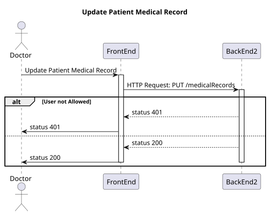
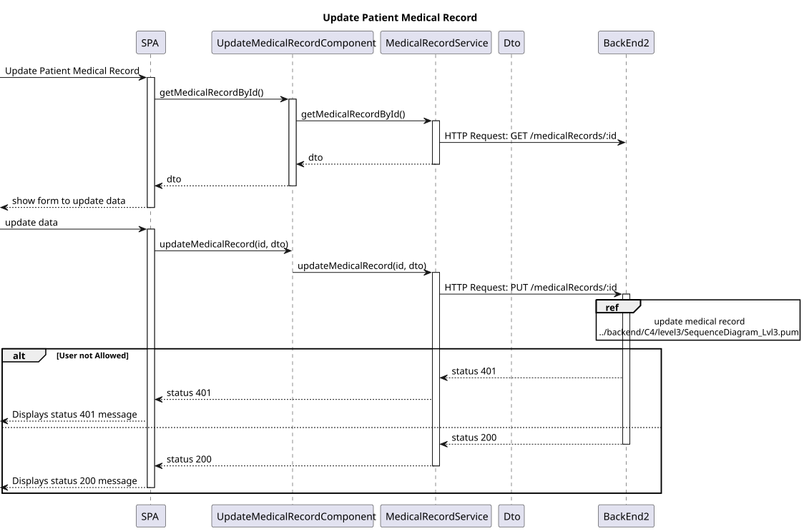

# US 7.2.6

## 1. Context

-   Implement functionality in the frontend and backend so that the doctor can update patient medical record.

## 2. Requirements

**US 7.2.6**- As a Doctor, I want to update the Patient Medical Record, namely respecting Medical Conditions and Allergies.

**Acceptance criteria:**

- Must be able to search for medical condition by code or designation
- When updating patient medical record can select entrys of medical condition from a dropdown search menu

## 3. Analysis

-   **Q**: O medical record pode incluir várias alergias e medical conditions.
Estas informações são suficientes ou considera necessário um campo de texto livre?
    -   **A**: sim. pode incluir o registo de várias alergias e conditions.
-   Medical Record é um conceito complexo tal como indicado em respostas anteriores no forum, e como tal deve ser modelado corretamente nesse sentido, por exemplo, através de recursos e subrecursos REST. Por exemplo, o novo serviço pode expor:
    * Allergy
    * Medical Condition
    * Medical Record
    * Medical Record Entry - Allergy
    * Medical Record Entry - Medical Condition
    * Medical Record Entry - Free Text

## 4. Design

### 4.1. Realization

#### BackEnd2

##### Level 1



##### Level 2



##### Level 3



#### FrontEnd

##### Level 1


##### Level 2



##### Level 3



### 4.2. Class Diagram


### 4.3. Applied Patterns

Applied Patterns description in [DevelopmentPatterns](../Global/DevelopmentPatterns/readme.md)

### 4.4. Tests

-   **FrontEnd**
    -   Update Medical Record component test
    ```
    it('should successfully update medical record and show success message', () => {...});
    it('should handle error when updating medical record fails', () => {...});
    ...
    ```
    -   Update Medical Record service test
    ```
    it('should successfully update a medical record', () => {...});
    it('should handle error when updating a medical record', () => {...});
    ```
-   **BackEnd2**
    -   Medical Record
    ```
    it('should update allergies in Medical Record', () => {...});
    it('should update medicalConditions in Medical Record', () => {...});
    it('should update freeTexts in Medical Record', () => {...});
    ```
    -  Medical Record Controller 
    ```
    it('on get medical record returns medical record', () => {...});
    it('on get medical record not found returns 404', () => {...});
    it('on update medical record returns updated record', () => {...});
    ```
    - Medical Record Service
    ```
    it('on get medical record returns medical record', () => {...});
    it('on get medical record not found returns 404', () => {...});
    it('on update medical record returns updated record', () => {...});
    ```
## 5. Implementation
-   **FrontEnd**
    -   Update Medical Record component test
    ```
    updateOnSubmit() {
        ...
        this.service
        .updateMedicalRecord(dto as MedicalRecordDTO, "63b329b1-b3aa-4e7c-b66d-fb2db6fa34ae")
        .subscribe({
            next: () => {
            this.toastr.success('Medical record updated successfully', 'Success');
            },
        ...
    }
    ...
    ```
    -   Update Medical Record service test
    ```
    updateMedicalRecord(medicalRecordDTO: MedicalRecordDTO,id: string): Observable<MedicalRecordDTO> {
        let req: Observable<MedicalRecordDTO>;
        req = this.http.put<MedicalRecordDTO>(
        this.baseUrl + '/' + id,
        medicalRecordDTO
        );
        ...
    }
    ```
-   **BackEnd2**
    -   Medical Record
    ```
    public update(allergies?: MedicalRecordAllergyProps[], medicalConditions?: MedicalRecordConditionProps[], freeTexts?: string[] ) {
        if(allergies){
        this.allergies = allergies;
        }
        if(medicalConditions){
        this.medicalConditions = medicalConditions;
        }
        if(freeTexts){
        this.freeTexts = freeTexts;
        }
    }
    ```
    -  Medical Record Controller 
    ```
    public async updateMedicalRecord(recordId: string, req: Request, res: Response, next: NextFunction) {
        ...
        const medicalRecordOrError = await this.medicalRecordServiceInstance.updateMedicalRecord(recordId, req.body as IMedicalRecordDTO) as Result<IMedicalRecordDTO>;
        ...
        const medicalRecordDTO = medicalRecordOrError.getValue();
        return res.status(201).json(medicalRecordDTO);
        ...
    }
    ```
    - Medical Record Service
    ```
    public async updateMedicalRecord(recordId: string ,medicalRecordDTO: IMedicalRecordDTO): Promise<Result<IMedicalRecordDTO>> {
        ...
        medicalRecord.update(medicalRecordDTO.allergies, medicalRecordDTO.medicalConditions, medicalRecordDTO.freeTexts);
                    
        await this.medicalRecordRepo.save(medicalRecord);
        ...
    }
    ```
## 6. Integration/Demonstration
* To execute this funcionality you need to log in as Doctor.