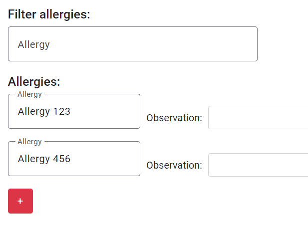
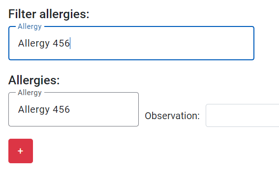

# US 7.2.7

## 1. Context

- The functionality is intended to make it easier for the doctor to find some allergy/medical condition in a patient medical record.

## 2. Requirements

**US 7.2.7** As a Doctor, I want to search for entries in the Patient Medical Record, namely respecting Medical Conditions and Allergies.

**Acceptance Criteria:**

- The doctor must be able to search in each section of the medical record.

## 3. Analysis

-   **Q**: Na tarefa 7.2.7, refere-se à filtragem de Medical Records através de Allergies e Medical Conditions ou à pesquisa de Allergies e Medical Conditions dentro de um Medical Record?
    -   **A**: Pretende-se procurar entradas do medical record em que exista menções a determinadas alergias ou condições médicas.

-   **Q**: Na User Story 7.2.7 ("As a Doctor, I want to search for entries in the Patient Medical Record, namely respecting Medical Conditions and Allergies. ") é mencionado que o objetivo é procurar por entries dentro do Medical Record relativas às alergias e às condições médicas. Como é que isto funcionaria? Seguindo o exemplo dado numa outra resposta deste forum o Medical Record estaria dividido em secções para alergias, condições medicas e uma secção de texto livre. Assumindo que as alergias por exemplo aparecem no topo como é que se mostraria o resultado da pesquisa ao utilizador?
    -   **A**: Como indicado, o Medical Record de um paciente é um objeto complexo com vários subobjetos. quando o utilizador consulta o registo médico do paciente deve visualizar cada seção do mesmo e ter a possibilidade de pesquisar cada uma das seções. por exemplo, a página do registo médico mostra uma tabela com as entradas de alergias, outra tabela com as entradas de medical condition, outra tabela com as entradas de texto livre, etc.

## 4. Design

### 4.1. Realization

- Above each section of the medical record, a filter option will be added.
- When the an allergy is selected in the filter list, only those allergies will appear in the allergy list. Same for the medical conditions.
- For the free texts, a text box will be added. When filled it will show the free texts that contains that filter.´
- When adding an allergy, medical condition or text, the filter should be disabled to avoid any confusion.

### 4.2. Tests

- **FrontEnd**
    - Update medical record component test
    ```
    it('should filter allergy')
    it('should disable allergy filter')
    it('should filter medical condition')
    it('should disable medical condition filter')
    it('should filter text')
    it('should disable text filter')
    ```

## 5. Implementation

- **Medical record allergy filter**
```
deactivateAllergyFilter() {
    this.allergyFilter.setValue('');
    this.filterAllergy(undefined);
}

filterAllergy(selectedAllergy: AllergyDto | undefined) {
    if (selectedAllergy == undefined || selectedAllergy == null) {
        for (let i = 0; i < this.allergiesVisible.length; i++) {
            this.allergiesVisible[i] = true;
        }
    } else {
        for (let i = 0; i < this.allergiesVisible.length; i++) {
            if (this.allergiesList[i].id == selectedAllergy.id) {
                this.allergiesVisible[i] = true;
            } else {
                this.allergiesVisible[i] = false;
            }
        }
    }
}
```

* The implementation of the filter for medical condition and free texts is identical.

## 6. Integration/Demonstration

- **Allergy without filter**


- **Allergy filtered**

