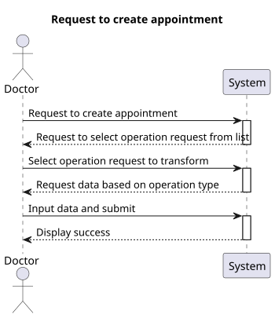
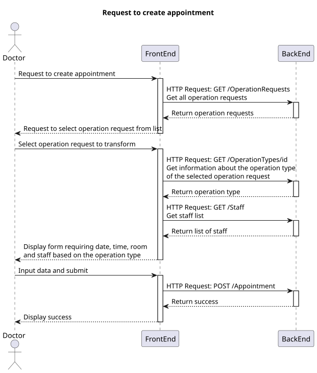
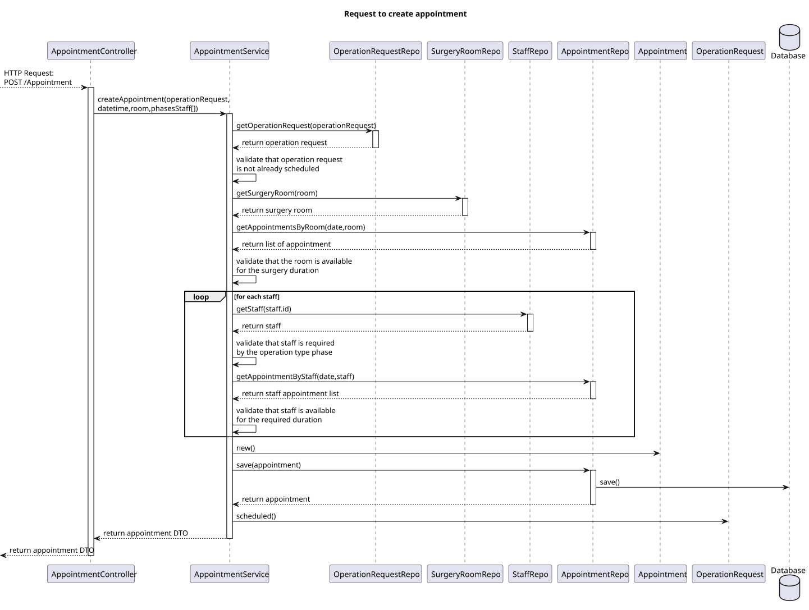
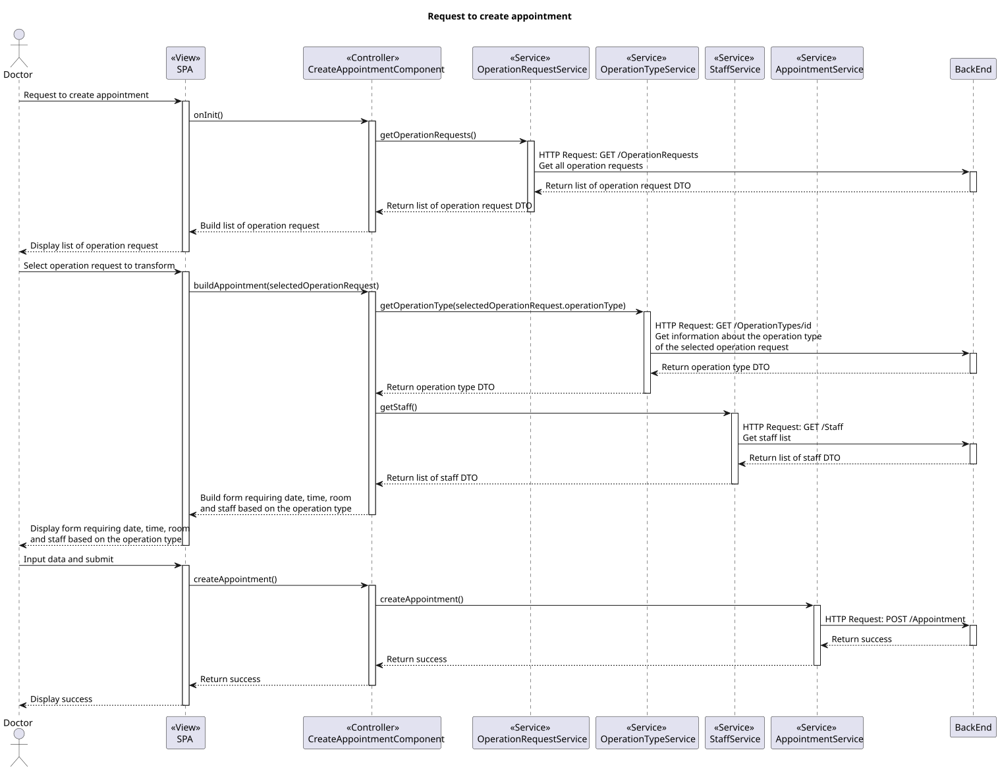
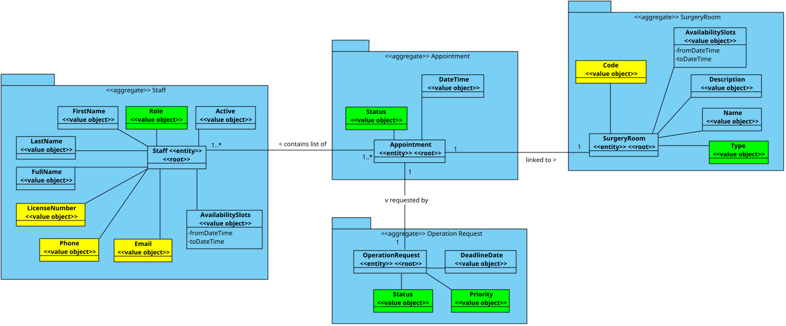

# US 7.2.8

## 1. Context

- This functionality must create an appointment from an existing operation request.

## 2. Requirements

**US 7.2.8** As a Doctor, I want to create a Surgery Appointment, so that the Patient doesn’t need to wait for the automatically generated planning.

**Acceptance Criteria:**

- To create an appointment, an existing valid operation request must be used.
- The appointment must include all of the staff required by the operation type phases, the room, the date and the time.
- The staff selected for the appointment must be available in that date and time.

## 3. Analysis

-   **Q**: Regarding the team selected by the doctor when creating the appointment, does this team include only doctors, doctors and anesthetists, or doctors, anesthetists and cleaners?
    -   **A**: It must include the whole team that conforms to the team composition according to the operation type specification.

-   **Q**: According to a previous answer about this requirement, when the doctor attempts the creation of an appointment, they specify room, date and team. But do they also specify the time in which the surgery should start?
    -   **A**: Yes.

-   **Q**: Should the doctor be able to make a surgery appointment without making a prior operation request for said appointment?
    -   **A**: The doctor must be able to "transform" an existing operation request into an actual appointment by specifying the room, date and team of the surgery. the system must ensure all the resources and personnel is available at the selected time according to the operation type duration.

-   **Q**: What exactly can the doctor update about the appointment? Can they, for example, change the surgery room for the surgery?
    -   **A**: After the appointment is planned, it is possible to update the team, room and date. the system must ensure all the resources and personnel is available at the selected time according to the operation type duration.

## 4. Design

### 4.1. Realization

##### Level 1



##### Level 2



#### BackEnd

##### Level 3



#### FrontEnd

##### Level 3



### 4.2. Class Diagram



### 4.3. Applied Patterns

Applied Patterns description in [DevelopmentPatterns](../../Global/DevelopmentPatterns/readme.md)

### 4.4. Tests

- **FrontEnd**
    - Create appointment component test
    ```
    it('should create the component')
    it('should initialize the form on ngOnInit')
    it('should fetch staff on ngOnInit')
    it('should fetch rooms on ngOnInit')
    it('should fetch operation request on ngOnInit')
    it('should fetch operation type on ngOnInit'){
    it('should show success message when appointment is created successfully')
    it('should show error message when creation fails')
    ```
    - Create appointment service test
    ```
    it('should fetch all rooms')
	it('should fetch all staff')
	it('should fetch operation request by id')
	it('should fetch operation type by ID')
	it('should create a new appointment')
    ```

- **BackEnd**
    - Appointment
    ```
    ShouldCreateAppointment()
    ShouldThrowErrorOnInvalid()
    ShouldCreateDto()
    ```
    - Service
    ```
    AddAsync_ShouldAddAppointment()
    AddAsync_ShouldThrowError_RoomNotFound
    AddAsync_ShouldThrowError_MissingPhases()
    AddAsync_ShouldThrowError_StaffNotFound()
    AddAsync_ShouldThrowError_OperationRequestNotFound()
    AddAsync_ShouldThrowError_OperationRequestAlreadyScheduled()
    AddAsync_ShouldThrowError_RoomUnavailable()
    AddAsync_ShouldThrowError_InvalidExtraStaff()
    AddAsync_ShouldThrowError_StaffUnavailable()
    ```

## 5. Implementation

* In the FrontEnd module, the appointment creation screen, builds a form that requests staff based on the operation type of the operation request being transformed.
```
if (resultOperationType != null) {
    let phases = this.appointmentForm.get('phases') as FormArray;
    while (phases.length !== 0) {
        phases.removeAt(0)
    }
    for (let i = 0; i < resultOperationType.phases.length && i < 3; i++) {
        phases.push(new FormGroup({
            'name': new FormControl(resultOperationType.phases[i].name, Validators.required),
            'staffs': new FormArray([])
        }));

        let phaseStaffIds: string[] = [];
        this.staffIds.push({ staff: phaseStaffIds });

        let staffs = phases.at(i).get('staffs') as FormArray;
        let specializationsMap: { [key: number]: number } = resultOperationType.phases[i].specializations;
        for (let j = 0; j < Object.keys(specializationsMap).length; j++) {
            let [key, value] = Object.entries(specializationsMap)[j];
            for (let v = 0; v < value; v++) {
                staffs.push(new FormGroup({
                    'specialization': new FormControl(key)
                }));
                phaseStaffIds.push('');
            }
        }
    }
}
```
* In the BackEnd module, all the validations are done (room availability, staff availability, etc.) and the operation request is marked as scheduled.
```
public async Task<AppointmentDto> AddAsync(CreatingAppointmentDto dto){
     // build and save appointment
    Appointment appointment = new(dto.DateTime, operationRequest, surgeryRoom, appointmentPhases);
    appointment = await this._appointmentRepo.AddAsync(appointment);
    // mark operation request as scheduled
    operationRequest.MarkAsScheduled();
    // commit transaction
    await this._unitOfWork.CommitAsync();
}
private bool IsRoomAvailable(List<Appointment> roomAppointments, int surgeryTotalDuration, DateTime surgeryStartDateTime)
private bool IsStaffAvailable(Staff staff, List<Appointment> staffAppointments, DateTime phaseStartDateTime, int phaseDuration)
```

## 6. Integration/Demonstration

* To create the appointment from an existing operation request, the user must click on the calendar button located in the operation requests search screen.
