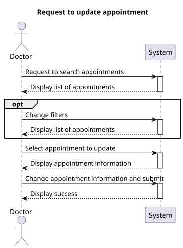
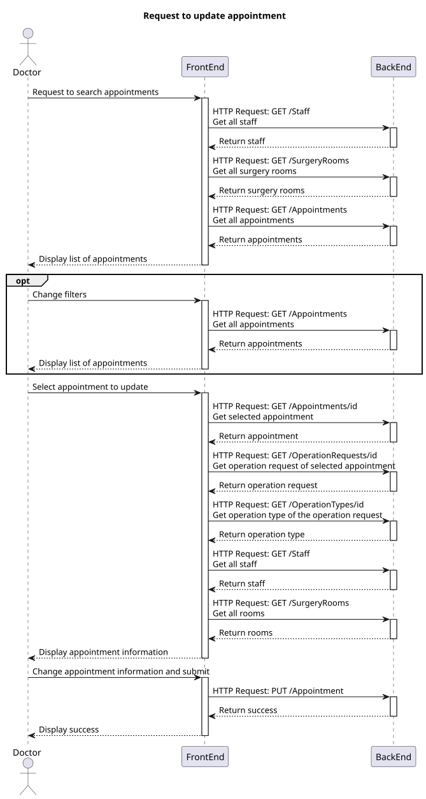
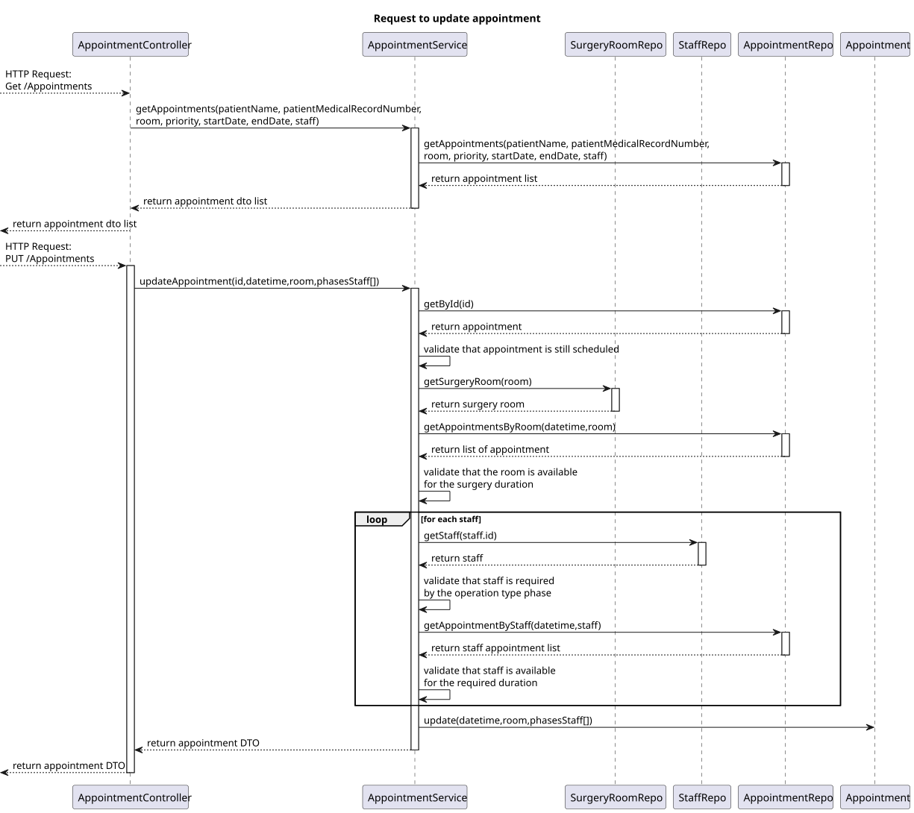
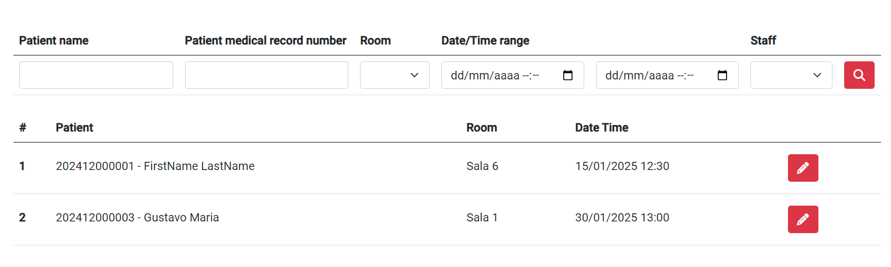
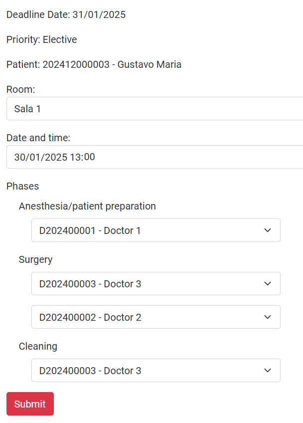

# US 7.2.9

## 1. Context

- This is the funcionality to update an existing appointment

## 2. Requirements

**US 7.2.9** As a Doctor, I want to update a Surgery Appointment, so that I can override the automatically generated planning.

**Acceptance Criteria:**

- To update an appointment, it must be in the scheduled state.
- The appointment must include all of the staff required by the operation type phases, the room, the date and the time.
- The staff selected for the appointment must be available in that date and time.
- The room selected for the appointment must be available in that date and time.

## 3. Analysis

-   **Q**: Regarding the team selected by the doctor when creating the appointment, does this team include only doctors, doctors and anesthetists, or doctors, anesthetists and cleaners?
    -   **A**: It must include the whole team that conforms to the team composition according to the operation type specification.

-   **Q**: What exactly can the doctor update about the appointment? Can they, for example, change the surgery room for the surgery?
    -   **A**: After the appointment is planned, it is possible to update the team, room and date. the system must ensure all the resources and personnel is available at the selected time according to the operation type duration.

-   **Q**: When a doctor is selecting the staff for an appointment, what should happen if, for every slot he could choose, there aren't enough staffs to perform the operation?
    -   **A**: The appointment cannot be scheduled for that date. the doctor must choose a different date.

## 4. Design

### 4.1. Realization

##### Level 1



##### Level 2



#### BackEnd

##### Level 3



#### FrontEnd

##### Level 3


### 4.2. Class Diagram


### 4.3. Applied Patterns

Applied Patterns description in [DevelopmentPatterns](../../Global/DevelopmentPatterns/readme.md)

### 4.4. Tests

- **FrontEnd**
    - Update appointment component test
    ```
	it('should initialize the form on ngOnInit')
    it('should fetch staff on ngOnInit')
    it('should fetch rooms on ngOnInit')
    it('should fetch appointment on ngOnInit')
    it('should fetch operation request on ngOnInit')
    it('should fetch operation type on ngOnInit')
    it('should create appointment dto')
    it('should show success message when appointment is updated successfully')
    it('should show error message when updating fails')
    ```
    - Search appointment component test
    ```
    it('should sort data correctly')
    it('should navigate to update page when updateAppointment is called')
    it('should search with filters')
    it('should handle empty search results')
    ```
    - Update/search appointment service test
    ```
    it('should fetch all rooms')
    it('should fetch all staff')
    it('should fetch operation request by Id')
    it('should fetch operation type by Id')
    it('should update an appointment')
    ```

- **BackEnd**
    - Appointment
    ```
    ShouldUpdateAppointment()
    ShouldThrowErrorOnInvalid()
    ShouldCreateDto()
    ```
    - Service
    ```
    UpdateAsync_ShouldUpdateAppointment()
    UpdateAsync_ShouldThrowError_RoomNotFound()
    UpdateAsync_ShouldThrowError_MissingPhases()
    UpdateAsync_ShouldThrowError_StaffNotFound()
    UpdateAsync_ShouldThrowError_AppointmentNotScheduled()
    UpdateAsync_ShouldThrowError_RoomUnavailable()
    UpdateAsync_ShouldThrowError_InvalidExtraStaff()
    UpdateAsync_ShouldThrowError_StaffUnavailable()
    ```

## 5. Implementation

- **FrontEnd**
```
getAllergy() {
    this.service.getAllergyById(this.allergyId).subscribe({
        next: (resultAllergy: AllergyDto | null) => {
            if (resultAllergy != null) {
                this.allergyForm.controls['code'].setValue(resultAllergy.code);
                this.allergyForm.controls['name'].setValue(resultAllergy.name);
                this.allergyForm.controls['description'].setValue(resultAllergy.description);
            } else {
                this.toastr.error('Allergy not found', 'Error');
                this.sendToSearch();
            }
        },
        error: (err: HttpErrorResponse) => {
            this.toastr.error('Allergy not found', 'Error');
            this.sendToSearch();
        }
    });
}
```

- **BackEnd**
```
public async Task<AppointmentDto> UpdateAsync(UpdatingAppointmentDto dto)
{
    Appointment appointment = await this._appointmentRepo.GetByIdAsync(new AppointmentId(dto.Id));
    if (appointment == null) return null;

    ...

    List<AppointmentPhase> appointmentPhases = await ValidateAppointment(
        appointment.OriginatingOn, surgeryRoom, dto.DateTime, dto.Phases, appointment.Id.ToInt);

    // update appointment
    appointment.Update(dto.DateTime, surgeryRoom, appointmentPhases);

    // commit transaction
    await this._unitOfWork.CommitAsync();
    return appointment.ToDto();
}
```

## 6. Integration/Demonstration

* To use this functionality the user must log in with an administrator account and access the "Allergy Management" menu.

- **FrontEnd Search**


- **FrontEnd Update**

