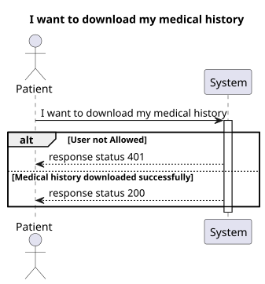
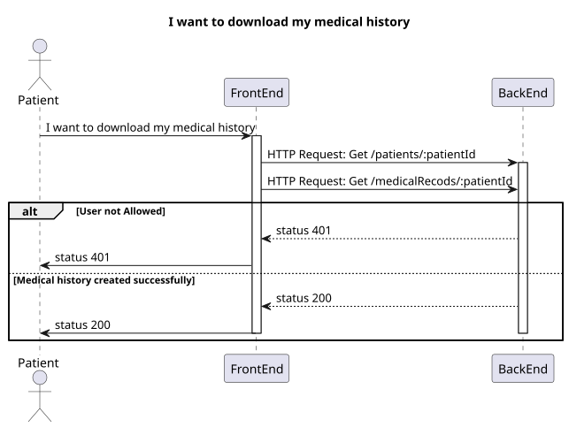
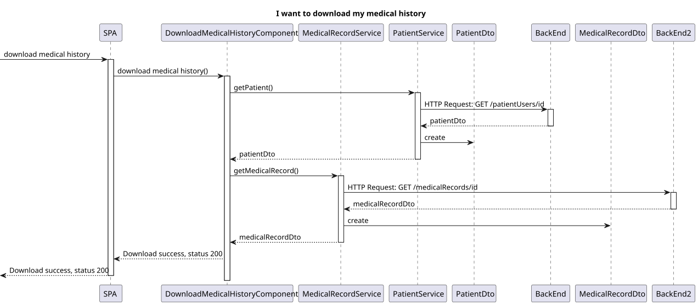

# US 7.6.1

## 1. Context

-   Implement functionality in the frontend and backend so that the patien can request to download is medical history.

## 2. Requirements

**US 7.6.1** As a Patient, I want to download my medical history in a portable and secure format, so that I can easily transfer it to another healthcare provider.


**Acceptance criteria:**

- Patients can request to download their medical history via their profile.


## 3. Analysis

-   **Q**: Could you please clarify what you mean by "Personal Data" in this user story?
    -   **A**: Unless stated otherwise, personal data means all personal data from the data subject's that you process. 
-   **Q**: What is considered a secure format?
What is the preferred format/extension of the downloadable file?
    -   **A**: de forma a garantir a segurança e confidencialidade dos dados aquando do pedido de portabilidade, sugiro um formato que possibilite a aposição, por exemplo, de uma password.
    Relembro que o ficheiro deve ser facilmente acessível pelo titular de dados pessoais, pelo que, deverá ser adotado um tipo de ficheiro comummente utilizado. 
-   **Q**: What format/s should be available? And what parts of the medical history should be used for this? all or only some specific.
    -   **A**: please use an easily machine-processable format like XML or JSON.
all medical, personal, information must be exported.

## 4. Design

### 4.1. Realization

#### FrontEnd

##### Level 1



##### Level 2



##### Level 3



### 4.2. Class Diagram


### 4.3. Applied Patterns

Applied Patterns description in [DevelopmentPatterns](../Global/DevelopmentPatterns/readme.md)

### 4.4. Tests

-   **FrontEnd**
    -   Download Medical History Component
    ```
    it('should download the medical history file', () => {...});
    it('should call services on ngOnInit', () => {...});
    ```
    

## 5. Implementation
-   **FrontEnd**
    -   Download Medical History Component
    ```
    async downloadMedicalHistory() {
        if (!this.patientMedicalRecord) {
        await this.getMedicalRecord();
        }
        if (!this.patient == null) {
        await this.getPatient();
        }
        let fileContent = this.fileContentToDownload();

        this.downloadFile(fileContent);
    }
    ```

## 6. Integration/Demonstration
* To use this functionality you need to login with your patient account.
