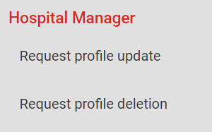
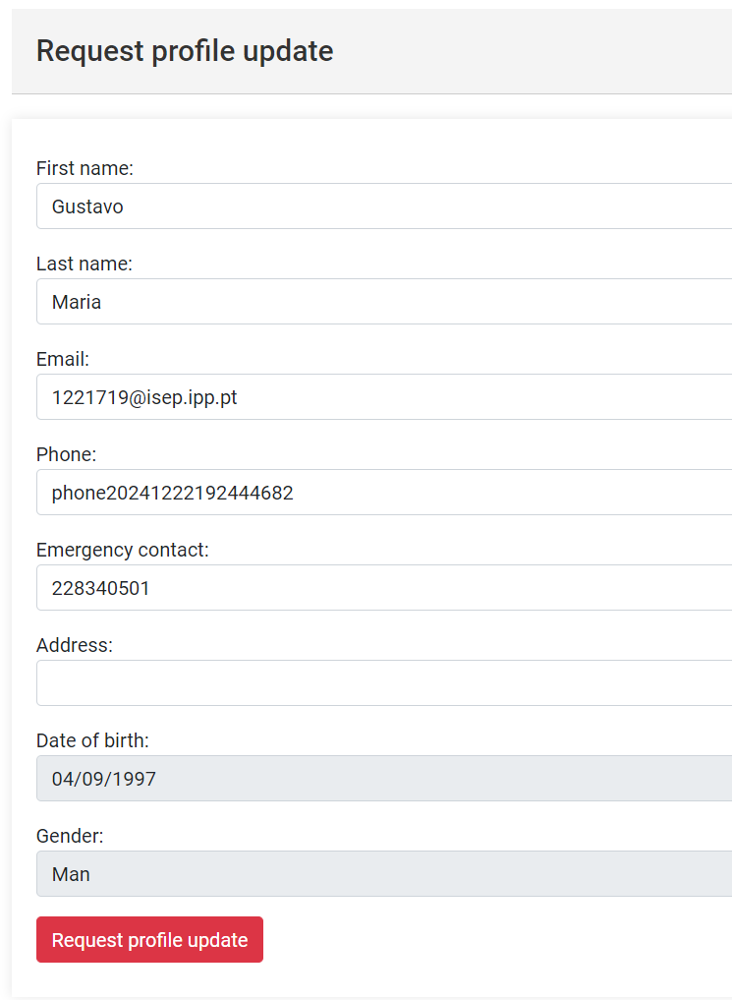
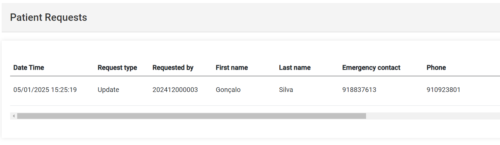

# US 7.6.2

## 1. Context

* This functionality will be used by the patient to request a profile update/deletion and it will also be used by the admin to apply those requested modifications.

## 2. Requirements

**US 7.6.2** As a Patient, I want to request the deletion of my personal data, so that I can exercise my right to be forgotten under GDPR.

## 3. Analysis

-   **Q**: How should the flow be? Since its a request, does it need to be approved by, for example the admin, or it doesnt need to be approved?
    -   **A**: This feature is about requesting the data deletion, not about the actual the actual deletion. The company must define their data deletion process. For instance, the DPO will receive these requests by email and will then manually, outside of the application, do the due diligence to check if the data can be deleted or not. if the data can be deleted, a specific order will be sent to the system admin to execute the proper data deletion or anonymization from the database.

## 4. Design

* An option for the patient to request a profile update will be implemented.
* An option for the patient to request a profile deletion will be implemented.
* An option for the admin to view the patient requests will be implemented.
* An option for the admin to delete patient requests will be implemented.

## 5. Implementation

- **FrontEnd service**
```
sendPatientRequest(patientRequest: CreatePatientRequestDto): Observable<PatientRequestDto> {
	let req: Observable<PatientRequestDto>;
	req = this.http.post<PatientRequestDto>(this.patientRequestUrl, patientRequest)
	return req.pipe(
		catchError((error: HttpErrorResponse) => {
			return throwError(() => error);
		})
	)
}
```

- **BackEnd service**
```
public async Task<PatientRequestDto> AddAsync(CreatePatientRequestDto dto)
{
	Patient patient = await _patientRepo.GetByEmailAsync(_authz.CurrentUserEmail());
	if (patient == null)
		throw new BusinessRuleValidationException("Patient profile not found");

	PatientRequest request = new PatientRequest(dto, patient.Id.AsString());

	request = await this._patientRequestRepo.AddAsync(request);
	await this._unitOfWork.CommitAsync();

	return request.ToDto();
}
```

## 6. Integration/Demonstration

* For the patient update and deletion requests, the patient must log in and access the sidebar menu.

<br>


* For the admin to review the patient requests, the admin must log in and access the "Patient requests" menu in the sidebar.


